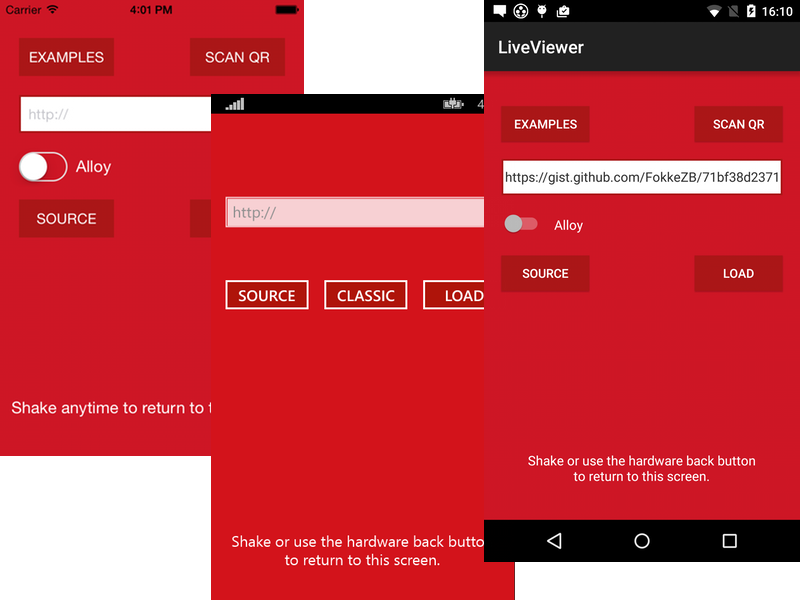

# LiveViewer App
An app to load and run Titanium and Alloy code from any URL, GitHub repositories and gists.

## Goal

* To provide a way for new users to try out Titanium and Alloy without needing to install it.
* To be able to quickly run a code snippet.

## Uses

* We could build a [TiFiddle](http://tifiddle.com/) like front-end with QR code and URL scheme to run it in the app.
* We could add a QR code to examplses in the documentation and blog posts to run it in the app.
* We could add a page to our main website where people can download the app and scan a unique QR code to run and edit an hello world example.

## Server
Projects in GitHub repositories and sources that need to be compiled with Alloy in the cloud will download the source via an instance of [appc-liveviewer-server](https://github.com/FokkeZB/appc-liveviewer-server).

For now, the app uses an instance at:
[http://node.fokkezb.nl:8080](http://node.fokkezb.nl:8080).

## Samples
The app loads a list of sample source URLs from the server, which redirects to a gist so we can update it easily

For now, [http://node.fokkezb.nl:8080/samples.json](http://node.fokkezb.nl:8080/samples.json) redirects to [https://gist.github.com/FokkeZB/d69277cbe15103bc0696](https://gist.github.com/FokkeZB/d69277cbe15103bc0696).

## QR
Use the *Scan QR* button to scan a QR code containing either:

### URL
Install a browser like [this one for Chrome](https://chrome.google.com/webstore/detail/the-qr-code-extension/oijdcdmnjjgnnhgljmhkjlablaejfeeb) to quickly open a Gist you are viewing in the app.

### JSON
Containing an source URL and optional Alloy switch:

	{"url":"https://github.com/appcelerator/movies","alloy":true}
	

### JS
Containing actual Titanium JS code:

	var win=Ti.UI.createWindow({backgroundColor:"white"});win.add(Ti.UI.createLabel({text:"Hello world"}));win.open();

%3Bwin.add(Ti.UI.createLabel(%7Btext%3A%22Hello%20world%22%7D))%3Bwin.open()%3B%0A)

## URLs
The app can load the following types of URLs directly as long as they don't use Alloy:

* Gists, including selecting a specific file via hashtag.
* Raw JS code.
* ZIP file containg a classic project.

The app can load the following types via the server:

* GitHub repo's, including a specific branch, subdirectory or file.
* Gists containing Alloy files, including `app.tss`, `alloy.js` etc.

## Ti-Proxy
The app relies on the Titaniumified version of the OSS [Ti-Proxy](https://github.com/fokkezb/ti-proxy) inspired by the [transformations](https://github.com/dbankier/TiShadow/blob/master/cli/support/uglify.js) David Bankier's TiShadow does.

## Known issues
See [GitHub](https://github.com/FokkeZB/appc-liveviewer-app/issues)
